.# 🧬 LifeLine Protocol
**The Decentralized Inheritance & Proof of Life Protocol on Starknet.**

LifeLine Protocol is a non-custodial, decentralized inheritance solution built on Starknet. It allows users to securely lock their crypto assets and ensure they automatically pass to designated loved ones if they become inactive, completely eliminating counterparty risk.

Built for the Starknet Community by [ZappyTheDev](https://zappythedev.web.app).

---

## ⚡ Try It Out

We have built a production-ready mobile app and a seamless web-connector for beneficiaries.

* 📱 **Download the Android APK:** [LifeLine App (Release v1.0)](link-to-your-apk-file-here.apk)
  

---

## 🔗 Verifiable On-Chain Deployment
LifeLine is live on the Starknet Sepolia Testnet.

* **Contract Address:** [`0x0620bb1bbe7b4f11adcb64e3ce90fd8cb4dca9c675cde6eb801cb74547bdbe8c`](https://sepolia.voyager.online/contract/0x0620bb1bbe7b4f11adcb64e3ce90fd8cb4dca9c675cde6eb801cb74547bdbe8c)
* **Class Hash:** `0x003162197d1fc6dacac849c6e988b040f8c48e22938c9d4fd55ef7497f04d89e`
* **Deployment Tx:** [`0x0603c4977089e7b0d4abd9cd08b7198ca465dd7f718e5c5d6bc2b8880cd9dff0`](https://sepolia.voyager.online/tx/0x0603c4977089e7b0d4abd9cd08b7198ca465dd7f718e5c5d6bc2b8880cd9dff0)

---

## 📸 Visual Walkthrough (The User Journey)

### 1. App Launch & Secure Authentication
Users securely log in to the LifeLine mobile app using their existing Starknet wallet (Braavos native bridge integrated).

<table>
  <tr>
    <td align="center">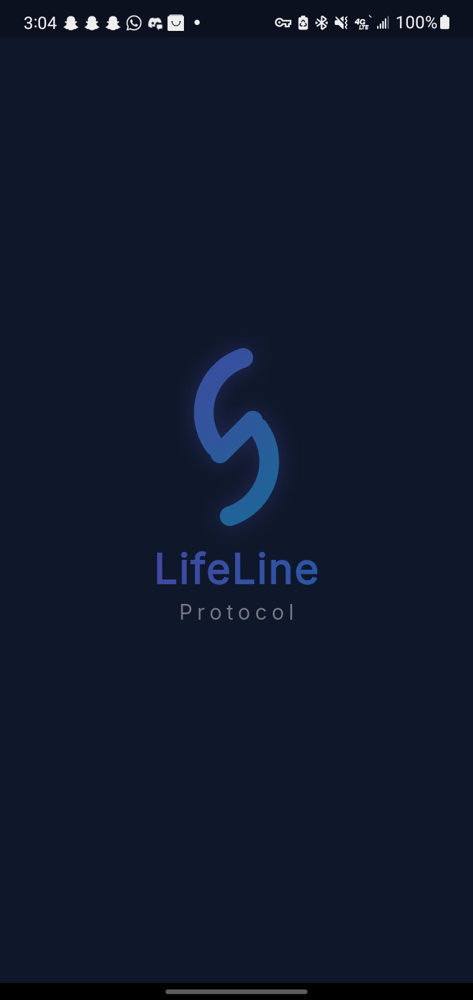 <b>Splash Screen</b></td>
    <td align="center">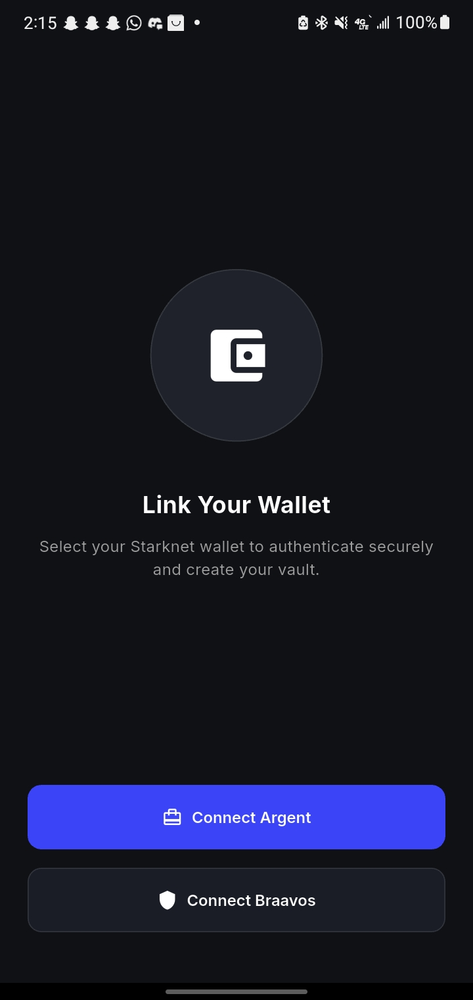 <b>Connect Wallet</b></td>
    <td align="center">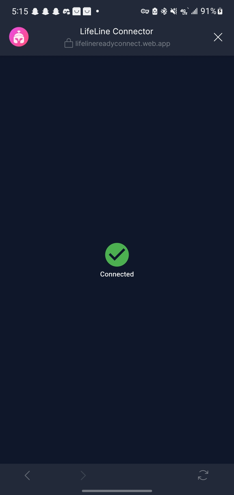 <b>Braavos Secure Bridge</b></td>
  </tr>
</table>

### 2. Dashboard & Vault Creation
Users define a beneficiary, lock Starknet tokens, and set their custom "Proof of Life" inactivity timer.

<table>
  <tr>
    <td align="center">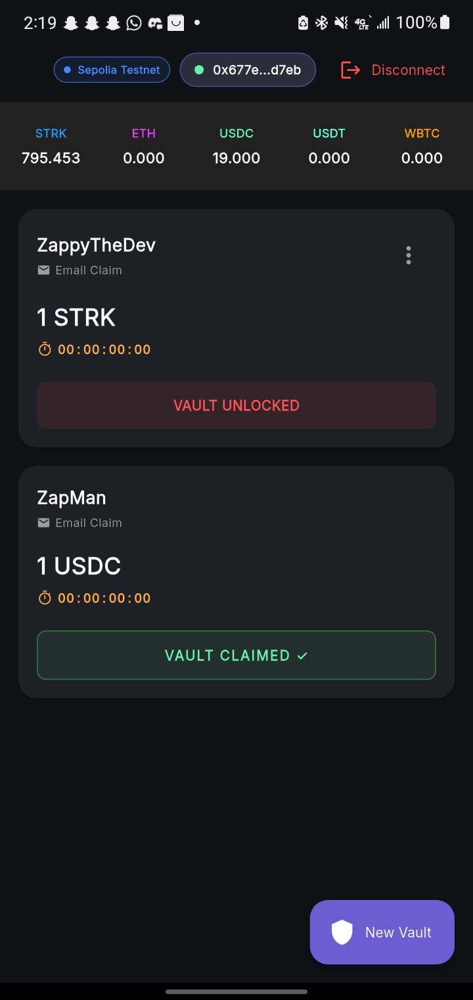 <b>Active Dashboard</b></td>
    <td align="center"> <b>Setting Parameters</b></td>
    <td align="center"> <b>Confirming Assets</b></td>
  </tr>
</table>

### 3. The Proof of Life Trigger
As long as the user pings the app, the vault remains locked. If the timer expires, the protocol dispatches an encrypted email to the beneficiary.

<table>
  <tr>
    <td align="center"> <b>Encrypted Email Dispatch</b></td>
    <td align="center"> <b>Secure Claim Link</b></td>
  </tr>
</table>

### 4. Seamless Web3 Claiming
The beneficiary clicks the email link, arriving at a premium Web3 interface. They enter the 6-digit PIN left by the creator, authenticate their own wallet, and claim the on-chain assets.
> 💡 **The Web2 to Web3 Bridge:** We use an ephemeral cryptographic key pair locked behind a standard 6-digit PIN. This allows Web2 users to receive a secure inheritance without needing to understand seed phrases or own a wallet upfront. The Web Connector acts as a bridge, decrypting their proof of identity locally in the browser and forcing them to onboard into the Starknet ecosystem to claim their funds.

<table>
  <tr>
    <td align="center">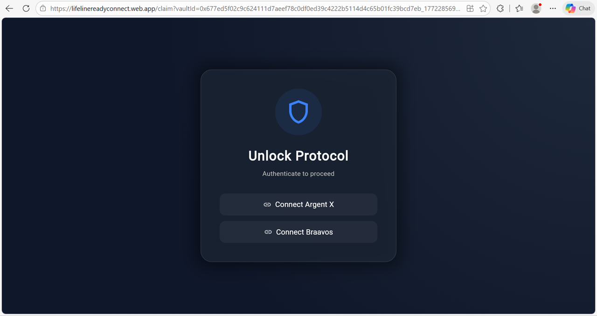 <b>Web Connector Login</b></td>
  </tr>
  <tr>
    <td align="center">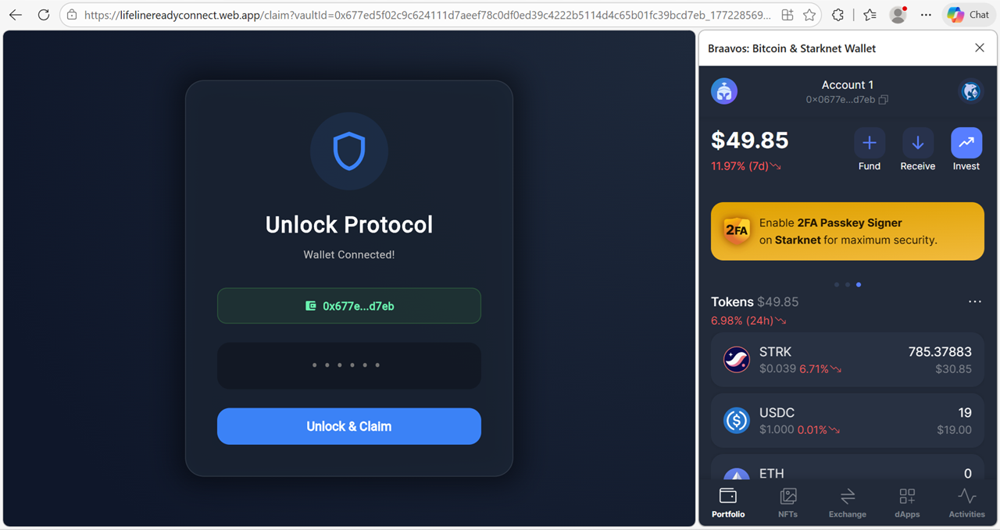 <b>Vault Decryption</b></td>
  </tr>
  <tr>
    <td align="center">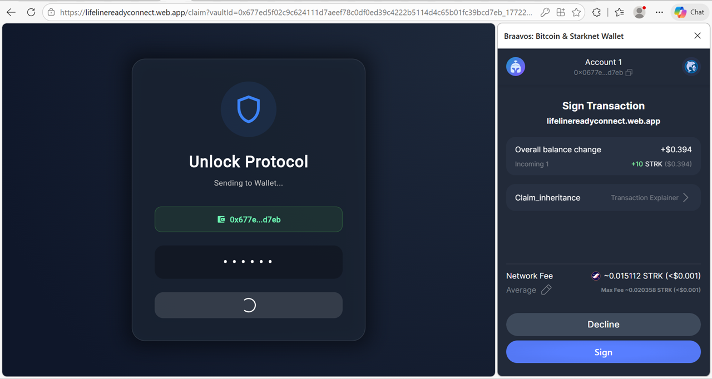 <b>Executing Multi-Call</b></td>
  </tr>
  <tr>
    <td align="center">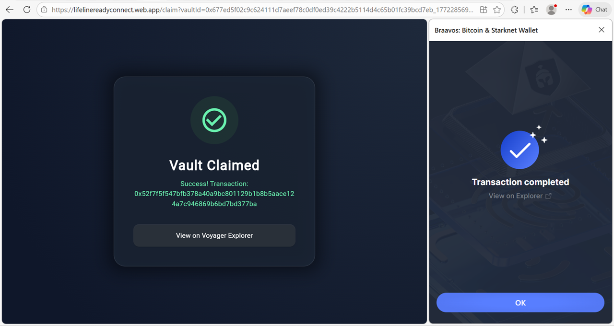 <b>Assets Transferred & Link Invalidated</b></td>
  </tr>
</table>

### 5. Additional Protocol Features
A look at the other robust features and settings within the LifeLine mobile experience.

<table>
  <tr>
    <td align="center">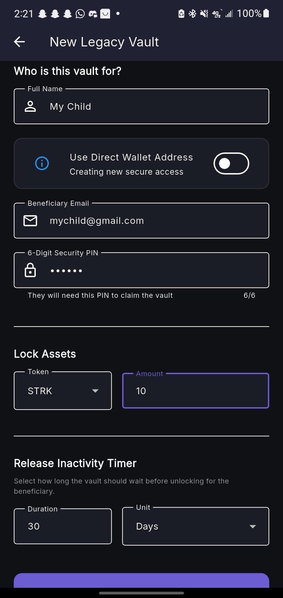</td>
    <td align="center">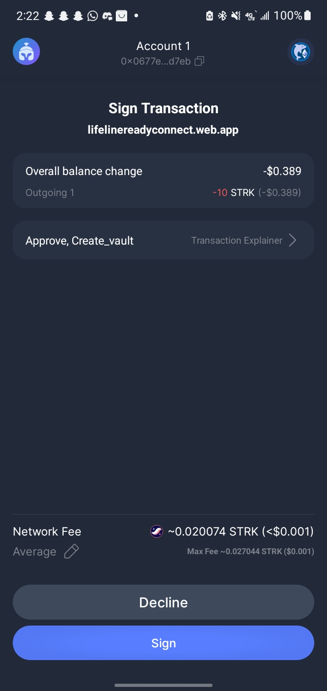</td>
    <td align="center">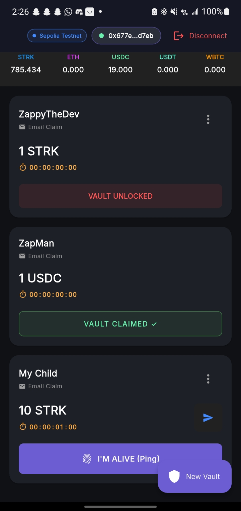</td>
    <td align="center">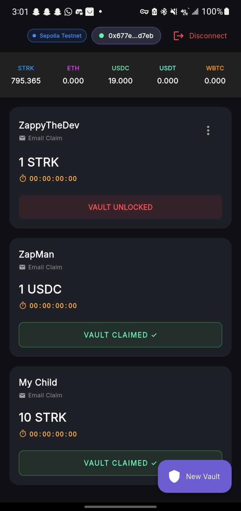</td>
  </tr>
</table>

---

## 🛠️ Architecture & Tech Stack

* **Smart Contracts:** Cairo 2.0 (Starknet)
  * Implements time-locked inheritance logic, public key encryption storage, and multi-call capabilities.
* **Mobile App:** Flutter (Dart)
  * Handles deep-linking, direct Braavos wallet integration via intent schemes, and secure local key generation.
* **Backend Bridge:** Firebase (Firestore)
  * Acts as an indexing bridge to listen for on-chain events and synchronize UI states between the wallet and the app in real-time.

---

## 🛡️ Security First
* **Zero Funds Custody:** LifeLine never holds your private keys.
* **Encrypted Secrets:** The ephemeral private key generated for non-Web3 native beneficiaries is encrypted using AES-256 and a user-defined PIN *before* touching any database.
* **Link Invalidation:** Once an inheritance link is executed on-chain, the web UI permanently locks to prevent replay attacks and points to the Voyager block explorer.

---

## 👨‍💻 Developer
**ZappyTheDev**
* Portfolio & More Apps: [zappythedev.web.app](https://zappythedev.web.app)
